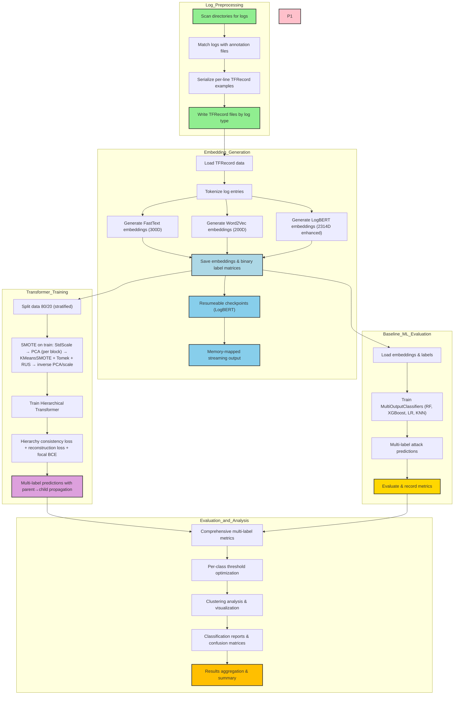

# LBAD - Log-Based Anomaly Detection Pipeline

An end-to-end pipeline for log-based anomaly detection with resumeable embedding generation, multi-label transformer training, and comprehensive evaluation. Optimized for Apple Silicon (M2/MPS) and supports CUDA/CPU.

## Highlights

- Preprocessing to TFRecords per log type
- Embeddings: LogBERT (2314D enhanced), FastText (300D), Word2Vec (200D)
- Resumeable, memory-mapped LogBERT extraction with 5% progress checkpoints
- One-vs-Rest multi-label transformer training with SMOTE on train-only
- Baseline multi-label ML (RF, LR, KNN, XGBoost) for comparison
- Clear artifacts: `embeddings/`, `models/`, `results/`, `checkpoints/`

## Pipeline Architecture



## Quick Start

```bash
make install                 # install requirements
make preprocess-wp-error     # build TFRecords from logs/ + labels/
make logbert-thesis-wp-error # generate LogBERT embeddings to embeddings/logbert/wp-error
make train-wp-error          # train transformer (uses legacy layout prepared by Makefile)
make evaluate-wp-error       # evaluate transformer on embeddings/wp-error
```

Tip: Run `make help` for a full command reference.

## Project Structure

```
.
├── logs/                     # raw logs by org/system
├── labels/                   # ground-truth annotations (JSON lines)
├── processed/                # TFRecords per log type (gzip)
├── embeddings/               # embeddings/<method>/<type>/{log,label}_<type>.pkl
├── models/                   # saved transformer checkpoints (*.pth)
├── results/                  # predictions, metrics, visualizations
├── checkpoints/              # logbert resumeable checkpoints
├── hf_cache/ .cache/torch/   # local HF/torch caches (auto by Makefile)
└── src/                      # source code
```

## Pipelines (Makefile)

The Makefile orchestrates the full workflow. Key targets:

```bash
make pipeline-all              # preprocess → embeddings → train → evaluate (all types)
make pipeline-<type>           # full pipeline for one type (e.g., wp-error)
make embeddings                # generate embeddings for all types (logbert, fasttext, word2vec)
make embeddings-<type>         # embeddings for a single type
make logbert-thesis[-<type>]   # LogBERT embeddings → embeddings/logbert/<type>
make fasttext-thesis[-<type>]  # FastText embeddings → embeddings/fasttext/<type>
make word2vec-thesis[-<type>]  # Word2Vec embeddings → embeddings/word2vec/<type>
make train[-<type>]            # transformer training
make train-<type>-sample       # training with sample size (faster)
make evaluate[-<type>]         # evaluation
make ml-baseline[-<type>]      # traditional ML baselines
make summarize                 # aggregate results
make status                    # show available data/artifacts
```

Notes
- Thesis runners will also prepare a legacy layout under `embeddings/<type>/` so `src/transformer.py` can auto-discover files.
- Override variables: `make thesis LOG_TYPES="wp-error" EMBEDDINGS="logbert fasttext"`.

## Data Preparation (TFRecords)

Script: `src/preprocessing.py`
- Scans `logs/` and matches to `labels/`
- Serializes per-line TFRecord examples with fields: `l` (log), `y` (labels JSON), `log_type`
- Output: `processed/<log-type>/*.tfrecord` (gzip)

Run manually:
```bash
python src/preprocessing.py               # all
python src/preprocessing.py --log-type wp-error
```

## Embeddings

### LogBERT (Enhanced 2314D)

Script: `src/logbert_embeddings.py`
- Components: CLS(768) + Mean(768) + Max(768) + Attention top-10 (2314D)
- Device: auto (MPS→CUDA→CPU), optimized for M2/MPS
- Resumeable: writes lightweight progress every ~5% and supports restart
- Streams to disk via numpy.memmap to avoid OOM

CLI:
```bash
python src/logbert_embeddings.py \
  [--log-type wp-error] \
  [--sample-size N] \
  [--force-restart] \
  [--clean-checkpoints|--clean-incremental] \
  [--output-subdir logbert]
```

Outputs (per log type under `embeddings/logbert/<type>/`):
- `log_<type>.pkl`: pickled memmap-backed matrix (2314D)
- `label_<type>.pkl`: dict with `vectors` (multi-label int8) and `classes`
- `attack_types_<type>.txt`: mapping and examples
- `visualization.png`: t-SNE (balanced sampling, all classes shown)

Defaults align with full-dataset processing; use `--sample-size` to subsample.

### FastText (300D)

Script: `src/fasttext_embedding.py`
```bash
python src/fasttext_embedding.py [--log-type <type>] [--output-subdir fasttext]
```
Outputs mirror LogBERT format under `embeddings/fasttext/<type>/`.

### Word2Vec (200D)

Script: `src/word2vec_embedding_thesis.py`
```bash
python src/word2vec_embedding_thesis.py [--log-type <type>] [--output-subdir word2vec]
```
Outputs mirror LogBERT format under `embeddings/word2vec/<type>/`.

## Transformer Training (Hierarchical + SMOTE)

Script: `src/transformer.py`
- Auto-detects device (cuda/mps/cpu)
- Splits data 80/20 (stratified)
- Applies SMOTE on the training split only (details below)
- Trains a single Hierarchical Transformer with per-node heads and parent→child propagation
- Uses focal BCE with bounded class weights, hierarchy consistency loss, and a light reconstruction loss
- AMP mixed precision, OneCycleLR, gradient clipping, and stability clamping

CLI:
```bash
python src/transformer.py
```

Artifacts:
- `results/hierarchical_<type>_evaluation_<timestamp>.txt` (per-class + overall metrics)
- `models/hierarchical_<type>.pth` (trained model)

## Evaluation

Transformer evaluation: `src/evaluate_models.py`
```bash
python src/evaluate_models.py --log-type wp-error [--optimize-thresholds]
```
Behavior
- Uses cached predictions from `results/<type>/predictions.pkl` when present
- Otherwise loads model + embeddings and evaluates; can auto-optimize per-class thresholds
- Saves detailed metrics and report to `results/<type>/`

Baselines: `src/ml_models.py`
```bash
python src/ml_models.py --log-type wp-error --model all
```
Generates reports and visualizations under `results/`.

## Performance & Caching

- Hugging Face/torch cache redirected to `hf_cache/` and `.cache/torch/` (see Makefile `HF_ENV`)
- MPS (Apple Silicon) and CUDA supported; batch sizes auto-tuned
- LogBERT extractor uses memmaps and 5% checkpoints for safe restarts

## Troubleshooting

- Embeddings not found: ensure `embeddings/<method>/<type>/log_<type>.pkl` and `label_<type>.pkl` exist
- Training uses legacy layout under `embeddings/<type>/`; Makefile thesis targets prepare this automatically
- Shape mismatches on eval: evaluator will attempt safe fixes; regenerate predictions if needed

## Technical Specifications & Findings

### Repository Structure
- **Main Components**: logs/, labels/, processed/, embeddings/, models/, results/, checkpoints/, src/
- **Key Scripts**: 
  - preprocessing.py - TFRecord generation
  - logbert_embeddings.py - Enhanced 2314D embeddings
  - fasttext_embedding.py - 300D embeddings  
  - word2vec_embedding_thesis.py - 200D embeddings
  - transformer.py - One-vs-Rest multi-label training with SMOTE
  - evaluate_models.py - Comprehensive evaluation
  - ml_models.py - Traditional ML baselines

### Embedding Specifications
- **LogBERT**: 2314D (CLS(768) + Mean(768) + Max(768) + Attention top-10)
- **FastText**: 300D subword-aware embeddings
- **Word2Vec**: 200D semantic vector representations
- **Hardware Support**: Apple Silicon (M2/MPS), CUDA, CPU
- **Training**: One-vs-Rest with SMOTE on training split only
- **Evaluation**: Micro/macro F1, precision, recall with threshold optimization

### Dataset Information
- **auth**: ~450 entries (small)
- **share**: ~1,507 entries (small) 
- **wp-error**: ~1,567 entries (small)
- **audit**: ~4,399 entries (small)
- **monitor**: ~8,278 entries (small)
- **vpn**: ~13,072 entries (medium)
- **wp-access**: ~221,902 entries (large)
- **dns**: ~521,563 entries (very large)

### Pipeline Features
- Resumeable processing with 5% checkpoints
- Memory-mapped operations to avoid OOM
- Auto device detection and batch size tuning
- Comprehensive artifact management
- Full reproducibility with Makefile orchestration

### Hierarchical Transformer: Architecture & Training

- Projections: CLS/Mean/Max (768→512), Attn (10→512); stack and encode with TransformerEncoder
- Bottleneck + Decoder: latent reconstruction supports representation regularization
- Heads: one linear head per hierarchy node; outputs logits (BCEWithLogits)
- Label Propagation: parent activations propagate to children at inference

Losses
- Focal BCE with bounded class weights (per-label weights ∈ [1, 10])
- Hierarchy consistency penalty: penalize child > parent probabilities
- Reconstruction MSE on concatenated features (small weight)

Optimization & Stability
- AdamW, OneCycleLR, AMP mixed precision (MPS/CUDA), gradient clipping
- Logit and loss clamping to avoid numerical issues; Xavier init for Linear layers

### SMOTE Implementation (Train-only)

Pipeline (per class, binary target):
- Standardize each block separately (CLS, MEAN, MAX, ATTN)
- PCA per block (dims up to 128; attn up to 10); concatenate reduced features
- KMeansSMOTE with adaptive k_neighbors, followed by SMOTETomek cleaning and RandomUnderSampler (0.8)
- Inverse PCA and inverse scaling to reconstruct original feature blocks
- Build augmented DataLoader with synthetic samples; falls back to original loader if SMOTE fails

## License

MIT. See `LICENSE`.

## Citation

```
@misc{lbad,
  title  = {Log-Based Anomaly Detection Pipeline},
  year   = {2025},
  author = {LBAD Contributors}
}
```
