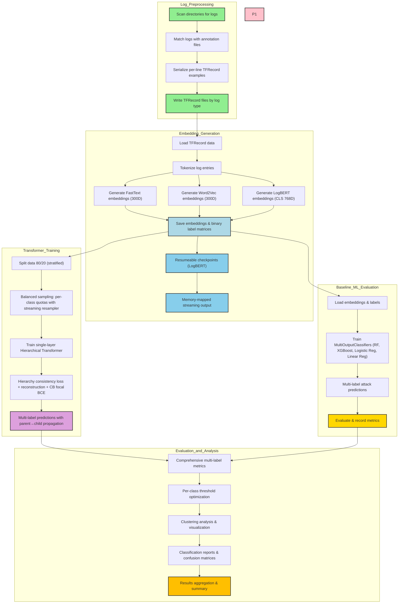

# LBAD - Log-Based Anomaly Detection Pipeline

An end-to-end pipeline for log-based anomaly detection with resumeable embedding generation, hierarchical multi-label transformer training, and comprehensive evaluation. Optimized for Apple Silicon (M2/MPS) and supports CUDA/CPU.

## Highlights

- Deterministic preprocessing → TFRecords per log type
- Embeddings: FastText (300D), Word2Vec (300D), LogBERT CLS (768D) with auto-layout detection in the trainer
- Adaptive SMOTE-style streaming resampler that equalises class quotas using percentile-aware targets
- Single-layer hierarchical transformer with parent→child propagation and class-balanced entropy loss (CB Focal BCE)
- Baseline multi-label ML (Logistic Regression, Linear Regression, Random Forest, XGBoost) for comparison
- Project-local caches (`./gensim_data`, `./.mplconfig`, `./hf_cache`) keep cluster home directories clean
- Clear artifacts: `embeddings/`, `models/`, `results/`, `checkpoints/`

## Pipeline Architecture



## Quick Start

```bash
make install                 # install requirements

# Run a quick test (5-10 minutes)
make quick-test              # test with wp-error + logbert (1/10 subset)

# Or run full pipeline for one log type (15-30 minutes)
make thesis-fast-wp-error    # wp-error with all embeddings (1/10 subset)

# Or run complete thesis pipeline (2-4 hours)
make thesis                  # all log types, all embeddings, all models
```

Tip: Run `make help` for a full command reference.

## Project Structure

```
.
├── logs/                     # raw logs by org/system
├── labels/                   # ground-truth annotations (JSON lines)
├── processed/                # TFRecords per log type (gzip)
├── embeddings/               # embeddings/<method>/<type>/{log,label}_<type>.pkl
├── models/                   # saved transformer checkpoints (*.pth)
├── results/                  # predictions, metrics, visualizations
├── checkpoints/              # logbert resumeable checkpoints
├── hf_cache/ .cache/torch/   # local HF/torch caches (auto by Makefile)
├── .mplconfig/               # matplotlib cache (auto)
├── gensim_data/              # gensim downloader cache (auto)
└── src/                      # source code
```

## Pipelines (Makefile)

The Makefile orchestrates the full workflow. Key targets:

```bash
make pipeline-all              # preprocess → embeddings → train → evaluate (all types)
make pipeline-<type>           # full pipeline for one type (e.g., wp-error)
make thesis                    # complete thesis pipeline: all embeddings + all models
make thesis-<type>             # thesis pipeline for specific log type
make thesis-fast               # fast pipeline with 1/10 subset (quick testing)
make thesis-fast-<type>        # fast pipeline for specific log type
make embeddings                # generate embeddings for all types (logbert, fasttext, word2vec)
make embeddings-<type>         # embeddings for a single type
make logbert-thesis[-<type>]   # LogBERT embeddings → embeddings/logbert/<type>
make fasttext-thesis[-<type>]  # FastText embeddings → embeddings/fasttext/<type>
make word2vec-thesis[-<type>]  # Word2Vec embeddings → embeddings/word2vec/<type>
make train[-<type>]            # transformer training
make train-<type>-sample       # training with sample size (faster)
make ml-baseline[-<type>]      # traditional ML baselines
make status                    # show available data/artifacts
make clean-old-results         # remove duplicate old results (keep latest)
```

Notes
- Thesis runners will also prepare a legacy layout under `embeddings/<type>/` so `src/transformer.py` can auto-discover files.
- Override variables: `make thesis LOG_TYPES="wp-error" EMBEDDINGS="logbert fasttext"`.
- All scripts output detailed timing and performance metrics.

## Data Preparation (TFRecords)

Script: `src/preprocessing.py`
- Scans `logs/` and matches to `labels/`
- Serializes per-line TFRecord examples with fields: `l` (log), `y` (labels JSON), `log_type`
- Output: `processed/<log-type>/*.tfrecord` (gzip)

Run manually:
```bash
python src/preprocessing.py               # all
python src/preprocessing.py --log-type wp-error
```

## Embeddings

### LogBERT CLS (768D)

Script: `src/logbert_embeddings.py`
- Components: single CLS embedding (768D) straight from `bert-base-uncased`
- Device: auto (MPS→CUDA→CPU)
- Checkpointing: optional progress snapshots for long runs
- Local caches: honours `./hf_cache` and `./.mplconfig`

CLI:
```bash
python src/logbert_embeddings.py \
  [--log-type wp-error] \
  [--sample-size N] \
  [--force-restart] \
  [--clean-checkpoints|--clean-incremental] \
  [--output-subdir logbert]
```

Outputs (per log type under `embeddings/logbert/<type>/`):
- `log_<type>.pkl`: float32 matrix of CLS embeddings (N × 768)
- `label_<type>.pkl`: dict with `vectors` (multi-label int8) and `classes`
- `attack_types_<type>.txt`: mapping and examples
- `visualization.png`: t-SNE (balanced sampling, all classes shown)

Defaults align with full-dataset processing; use `--sample-size` to subsample.

### FastText (300D)

Script: `src/fasttext_embedding.py`
```bash
python src/fasttext_embedding.py [--log-type <type>] [--output-subdir fasttext]
```
- Uses pre-trained fasttext-wiki-news-subwords-300 model
- Outputs mirror LogBERT format under `embeddings/fasttext/<type>/`

### Word2Vec (300D)

Script: `src/word2vec_embedding.py`
```bash
python src/word2vec_embedding.py [--log-type <type>] [--output-subdir word2vec]
```
- Uses pre-trained word2vec-google-news-300 model
- Outputs mirror LogBERT format under `embeddings/word2vec/<type>/`

## Transformer Training (Hierarchical + Balanced Sampling)

Script: `src/transformer.py`
- Auto-detects device (cuda/mps/cpu) with optimized backend selection
- Splits data 80/20 (stratified by anomaly presence)
- Applies streaming balanced resampling with per-class quotas on the training split
- Trains a single-layer Hierarchical Transformer with per-node heads and parent→child propagation
- Uses class-balanced focal BCE (CB Entropy), hierarchy consistency loss, and reconstruction loss
- AMP mixed precision (CUDA/MPS), OneCycleLR scheduler, gradient clipping, and stability clamping

CLI:
```bash
python src/transformer.py [--embedding-type {fasttext,word2vec,logbert,all}] [--log-type <type>] [--sample-size N]
```

Artifacts:
- `results/hierarchical_<type>_<embedding>_evaluation_<timestamp>.txt` (per-class + overall metrics)
- `models/hierarchical_<type>_<embedding>.pth` (trained model)

### Adaptive SMOTE-Style Resampling
- Builds per-class index pools (normal + anomalies) without materialising augmented tensors
- Chooses a shared class quota using anomaly percentiles (median / 75th / 90th) with safety caps
- Guarantees identical sample counts for every class while respecting `MIN_SYNTHETIC_TARGET`
- Console output marks adjustments with arrow indicators (↑ / ↓ / →) for quick audits

## Evaluation

Transformer evaluation is integrated into the training script (`src/transformer.py`).
Evaluation metrics are automatically computed and saved to `results/hierarchical_<type>_<embedding>_evaluation_<timestamp>.txt`.

Baselines: `src/ml_models.py`
```bash
python src/ml_models.py [--embedding-type {fasttext,word2vec,logbert,all}] [--log-type <type>]
```
- Trains classical ML models: Logistic Regression, Linear Regression, Random Forest, XGBoost
- Uses MultiOutputClassifier/MultiOutputRegressor wrappers for multi-label support
- Generates detailed reports under `results/baseline_<model>_<type>_<embedding>_evaluation_<timestamp>.txt`

## Hardware Requirements

**Minimum:**
- CPU: 4 cores
- RAM: 8GB
- Storage: 5GB free space

**Recommended:**
- CPU: 8+ cores (Apple M2 or Intel i7/i9)
- RAM: 16GB+
- GPU: Apple Silicon (MPS) or NVIDIA GPU with 8GB+ VRAM
- Storage: 10GB free space

**Supported Devices:**
- Apple Silicon (M1/M2/M3) with MPS acceleration
- NVIDIA GPUs with CUDA support
- CPU-only mode (slower but functional)

## Performance & Caching

- Hugging Face/torch cache redirected to `hf_cache/` and `.cache/torch/`; gensim/matplotlib use `./gensim_data` and `./.mplconfig`
- MPS (Apple Silicon) and CUDA supported; batch sizes auto-tuned
- LogBERT extractor emits CLS-only vectors and can checkpoint progress for long runs

## Performance Benchmarks

Typical execution times on Apple M2 (16GB):
- **Preprocessing**: ~5-10s per log type (depends on size)
- **FastText Embeddings**: ~30-60s per log type
- **Word2Vec Embeddings**: ~30-60s per log type  
- **LogBERT Embeddings**: ~2-5m per log type (GPU accelerated)
- **Transformer Training**: ~1-3m per model (10 epochs)
- **ML Baselines**: ~30s-2m per log type (depends on model)

Full thesis pipeline (all embeddings + all models): ~15-30 minutes for wp-error

## Troubleshooting

- Embeddings not found: ensure `embeddings/<method>/<type>/log_<type>.pkl` and `label_<type>.pkl` exist
- Training uses legacy layout under `embeddings/<type>/`; Makefile thesis targets prepare this automatically
- For memory issues with large datasets, use `--sample-size` parameter

## Technical Specifications & Findings

### Repository Structure
- **Main Components**: logs/, labels/, processed/, embeddings/, models/, results/, checkpoints/, src/
- **Key Scripts**: 
  - preprocessing.py - TFRecord generation with log type classification
  - logbert_embeddings.py - CLS-based BERT embeddings with optional checkpointing
  - fasttext_embedding.py - 300D pre-trained FastText embeddings
  - word2vec_embedding.py - 300D pre-trained Word2Vec embeddings
  - transformer.py - Hierarchical multi-label transformer with balanced sampling
  - ml_models.py - Classical ML baselines (LR, Linear, RF, XGBoost)

### Embedding Specifications
- **LogBERT**: 768D CLS vectors (replicated into mean/max streams inside the transformer)
- **FastText**: 300D pre-trained subword-aware embeddings (fasttext-wiki-news-subwords-300)
- **Word2Vec**: 300D pre-trained semantic vectors (word2vec-google-news-300)
- **Hardware Support**: Apple Silicon (M2/MPS), CUDA, CPU with automatic device detection
- **Training**: Hierarchical transformer with streaming balanced resampling
- **Evaluation**: Micro/macro F1, precision, recall, Jaccard score, anomaly detection metrics

### Dataset Information
- **auth**: ~450 entries (small)
- **share**: ~1,507 entries (small) 
- **wp-error**: ~1,567 entries (small)
- **audit**: ~4,399 entries (small)
- **monitor**: ~8,278 entries (small)
- **vpn**: ~13,072 entries (medium)
- **wp-access**: ~221,902 entries (large)
- **dns**: ~521,563 entries (very large)

### Pipeline Features
- Resumeable processing with optional checkpoints
- Project-local caches for matplotlib, gensim, Hugging Face
- Auto device detection and batch-size tuning
- Comprehensive artifact management
- Full reproducibility with Makefile orchestration

### Hierarchical Transformer: Architecture & Training

**Architecture** (TransformerConfig defaults: hidden_dim=384, bottleneck_dim=192, num_heads=4, dropout=0.1)
- Projections: CLS/Mean/Max (768→384), Attn (10→384); non-LogBERT embeddings are padded/replicated automatically so the transformer sees a uniform layout
- Bottleneck + Decoder: 384→192→384→(3×768 + 10) reconstruction for representation regularization
- Heads: one linear head (192→1) per hierarchy node; logits consumed by class-balanced focal BCE
- Label Propagation: parent probabilities propagate to children via dynamic programming at inference

**Losses**
- Focal BCE with bounded class weights (per-label weights ∈ [1, 10], alpha=1.0, gamma=1.0)
- Hierarchy consistency penalty: smooth L1 loss between base and propagated probabilities
- Reconstruction MSE on concatenated features (lambda=0.05)
- Total loss = 0.05×recon + BCE + 0.02×hierarchy

**Optimization & Stability**
- AdamW optimizer with weight_decay=1e-4, fused kernels on CUDA
- OneCycleLR scheduler (max_lr=1e-4)
- AMP mixed precision (CUDA/MPS), gradient clipping (max_norm=5.0)
- Logit clamping [-10, 10] and loss clamping to avoid numerical issues
- Xavier uniform initialization for all Linear layers

### Balanced Sampling Implementation

**Streaming Resampler** (`BalancedBatchSampler`):
- Computes per-class quotas based on leaf and parent node targets
- Leaf quota: `BALANCED_SAMPLE_TARGET` (20,000 by default)
- Parent nodes get additional quota: base + sum of children's targets
- Normal samples matched to leaf quota for balance
- Cycles through class indices with shuffling to satisfy quotas without materializing synthetic data
- Falls back to original loader if resampling configuration is invalid

**Key Parameters**:
- `BALANCED_SAMPLE_TARGET = 20000`: Maximum samples per leaf class per epoch
- `TARGET_CONTAMINATION = 0.2`: Desired anomaly ratio (not strictly enforced)
- `TRAIN_SPLIT_RATIO = 0.8`: Train/test split ratio with stratification
- `MAX_CLASS_TRAIN_FRACTION = 0.8`: Maximum proportion of any class allocated to training

## Validation

Before running the pipeline, validate your setup:
```bash
./validate_pipeline.sh
```

This script checks:
- Python installation and version
- Required directory structure
- Python package dependencies
- Existing embeddings and models
- Estimated pipeline execution times

## License

MIT. See `LICENSE`.

## Citation

```
@misc{lbad,
  title  = {Log-Based Anomaly Detection Pipeline},
  year   = {2025},
  author = {LBAD Contributors}
}
```
